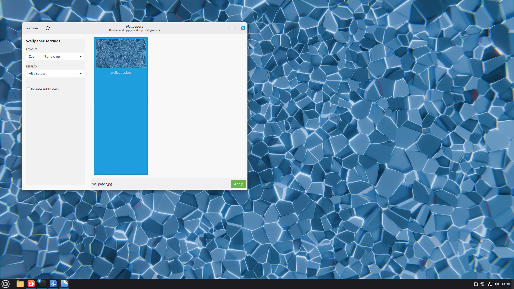

# XWallpaper GUI

A lightweight Python/GTK wallpaper browser for Linux. Choose a folder, browse
its images in a thumbnail gallery, and apply one using `xwallpaper`.



## Features

- Remembers the chosen wallpaper folder.
- Shows PNG and JPEG files supported by `xwallpaper` in a responsive grid.
- Can include subfolders.
- Applies the selected thumbnail with a button or double-click.
- Supports all displays or one display detected through `xrandr`.
- Offers zoom, maximize, stretch, centre, and tile layouts.
- Saves the last wallpaper, layout, display, and folder.
- Adds the selected `xwallpaper` command to `~/.xinitrc` so it is restored
  when an X11 session is started with `startx`.
- Adds the command to DWM's per-user autostart script, including when DWM is
  passed directly to `startx` and `~/.xinitrc` is bypassed.
- Supports non-interactive restoration with `--restore` for other startup systems.

The app does not copy, move, or modify wallpaper files.

## Install

XWallpaper GUI is installed from this GitHub repository. It is **not** currently
published in the Debian, Ubuntu, Arch, Fedora, or other distribution
repositories.

Open a terminal and run:

```sh
git clone https://github.com/praisetux/xwallpaper-gui.git
cd xwallpaper-gui
./install.sh
```

The installer checks everything the app needs. On Debian, Ubuntu, Linux Mint,
and Arch-based systems, it can offer to install missing system dependencies.
Those packages are Python, GTK, `xwallpaper`, and `xrandr`—not XWallpaper GUI
itself. On other distributions it lists what is missing without guessing an
unsafe or unavailable package command.

Once setup finishes, open the desktop application menu and search for
**XWallpaper GUI**. The app installation is user-local and places:

- The executable at `~/.local/bin/xwallpaper-gui`.
- The application modules at `~/.local/share/xwallpaper-gui/`.
- The menu launcher at
  `~/.local/share/applications/io.github.xwallpaper_gui.desktop`.

No terminal command is needed for normal use after installation. Some
application menus take a few seconds to notice a new launcher.

### Update

From the cloned `xwallpaper-gui` folder, update the source and installed app
with one command:

```sh
./install.sh update
```

The updater fast-forwards the Git checkout and installs the refreshed files.
It stops without changing anything if the checkout contains uncommitted work.

### Requirements

- An X11 session (`xwallpaper` is an X11 application)
- Python 3, GTK 3, and PyGObject
- `xwallpaper`
- `xrandr`

To remove the executable and menu entry:

```sh
./install.sh uninstall
```

Uninstalling keeps saved wallpaper preferences.

Each successful Apply updates a marked block in `~/.xinitrc`. Existing content
is preserved and repeated changes replace that block rather than adding duplicate
commands. This takes effect for X11 sessions started through `startx`.

The same marked block is written to
`$XDG_DATA_HOME/dwm/autostart.sh` (normally
`~/.local/share/dwm/autostart.sh`) and the script is made executable. This is
used by DWM even when it is launched as an explicit `startx` client.

Desktop environments that do not read `~/.xinitrc` can instead run this command
from their own startup configuration:

```sh
/absolute/path/to/xwallpaper-gui --restore
```

Settings are stored in
`$XDG_CONFIG_HOME/xwallpaper-gui/settings.json`, or
`~/.config/xwallpaper-gui/settings.json` when that variable is unset.

## Limitations

- X11 only.
- Different images can be applied to displays one at a time; there is no
  multi-display arrangement editor yet.
- Very large or remote wallpaper collections may take time to scan, but scanning
  and thumbnail decoding run in the background so the interface stays usable.

## AI Notice

AI-assisted tools were used during the development of this project.
